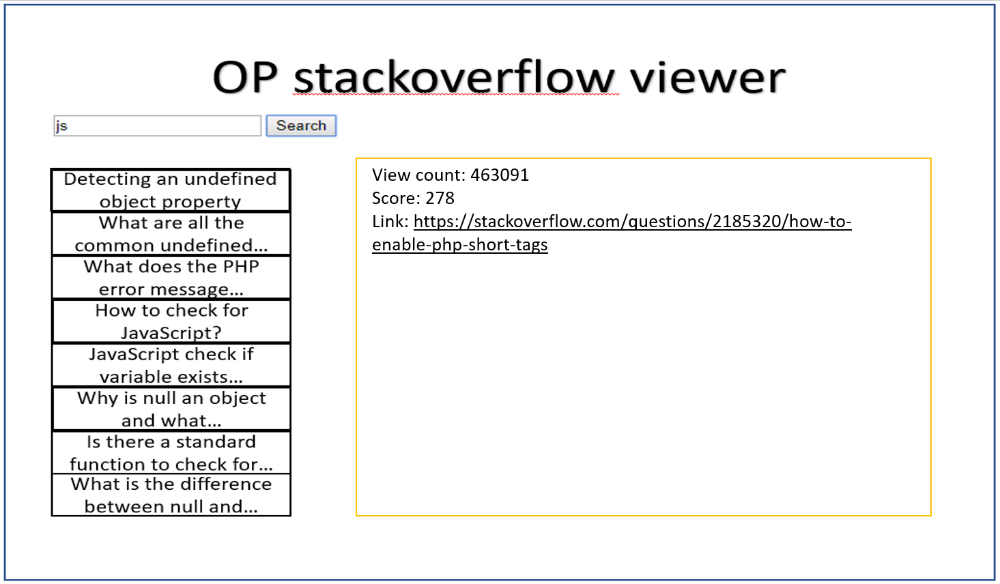

# StackOverflowWordSearch

This project was generated with [Angular CLI](https://github.com/angular/angular-cli) version 7.3.0.

## Requirements

OP Stackoverflow navigator
Build an Angular application that will get an input from the user and search by tag in stackoverflow service.
The page will be divided to 3 sections.

1. Search bar – the text input from the user to be searched by.
2. Questions list view – display the questions that came up from searching by the input from the search bar.
   Each question will be represented by its title.
3. Question page view – by clicking on question title in the question list the question viewer will display the view count, score and link to the answer.


Stackoverflow API:

```
GET: https://api.stackexchange.com/2.2/tags/${tag}/faq?site=stackoverflow
```

When building your app take note building a modular app
